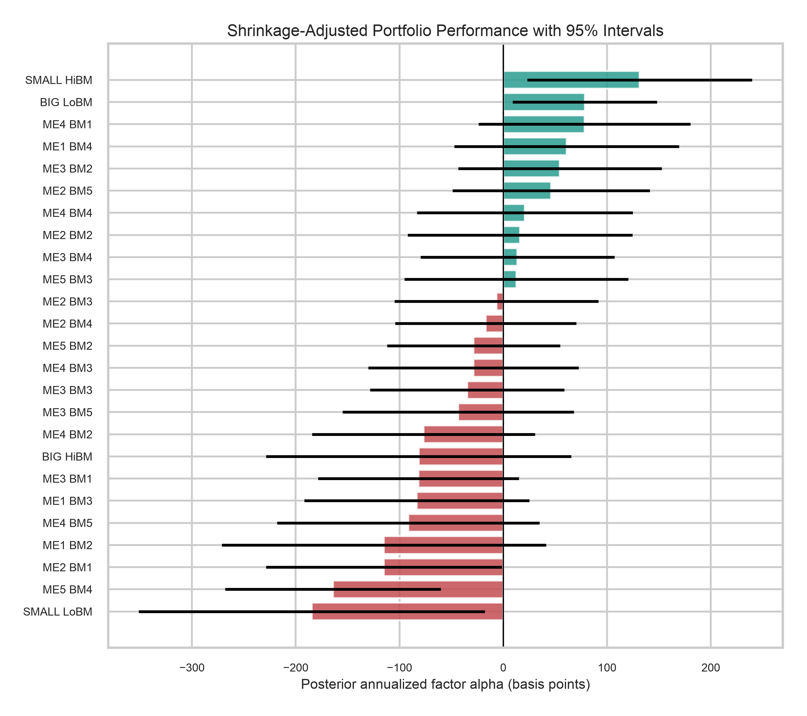
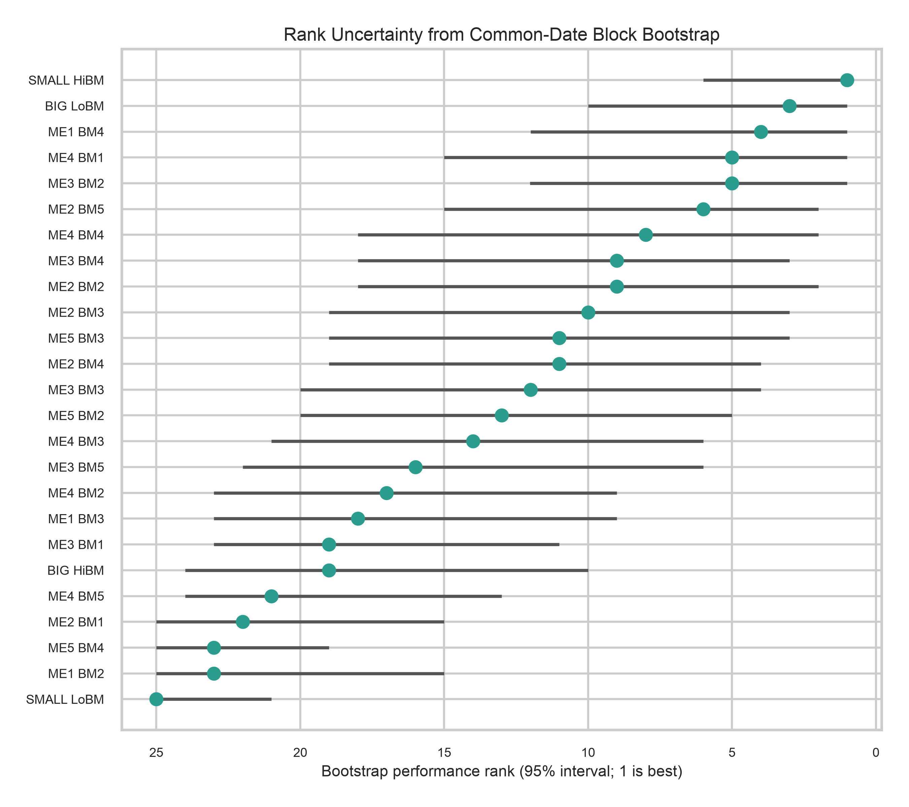
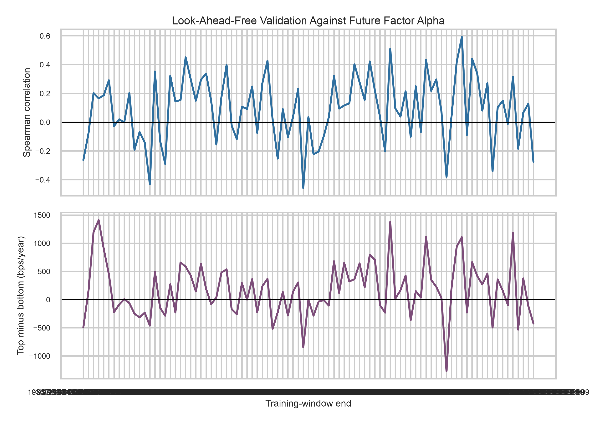

# Uncertainty-Aware Risk-Adjusted Portfolio Benchmarking

This project benchmarks the 25 Fama-French size/book-to-market portfolios using
factor-adjusted returns, full cross-portfolio HAC inference, multivariate
empirical-Bayes shrinkage, bootstrap rank uncertainty, and strictly forward
validation.

The primary estimand is posterior factor alpha. Stochastic frontier analysis
(SFA) is retained only as a secondary residual-asymmetry diagnostic because a
free intercept and a persistent non-negative shortfall are not separately
identified without additional structure.

## Current findings

- The immutable local sample has 25 portfolios and 1,193 months from July 1926
  through November 2025, with no duplicate keys or missing calendar months.
- The fitted joint prior has mean -26 bps/year and cross-sectional standard
  deviation 94 bps/year. The full HAC covariance condition number is 139.4 and
  requires no eigenvalue flooring.
- `SMALL HiBM` ranks first at 132 posterior bps/year. Two posterior intervals
  are wholly positive—`SMALL HiBM` and `BIG LoBM`—while bootstrap rank
  intervals remain broad.
- Five raw alpha tests survive 5% BH FDR. The primary dependence-robust joint
  HAC/Wald test rejects zero alpha across all portfolios (p = 6.42e-10).
- Across 89 forward windows, the Fisher-averaged rank correlation is 0.102
  (HAC 95% CI 0.055 to 0.149; p = 2.32e-05). Average top-quintile minus average
  bottom-quintile future alpha is 243 bps/year (HAC 95% CI 153 to 333;
  p = 1.30e-07); the median is 209.
- Two SFA boundary tests are nominally significant, but only `ME5 BM4` survives
  BH correction across all 25 tests. Only that case receives an SFA rank.
- The 1,000-versus-5,000 bootstrap comparison changes rank interval endpoints
  by at most one rank, but alpha tail endpoints by as much as about 27
  annualized bps. The final outputs therefore use 5,000 draws.

These are historical research diagnostics, not trading returns or investment
advice.

## Statistical model

For portfolio `i` and month `t`:

```text
r_it - r_ft = alpha_i + beta_i' f_t + epsilon_it.
```

Common-date OLS score vectors produce the full cross-portfolio Bartlett HAC
covariance `V`. The hierarchy is

```text
alpha_hat | alpha ~ Normal(alpha, V)
alpha             ~ Normal(mu * 1, tau^2 I)
```

and the posterior mean is

```text
mu * 1 + tau^2 (V + tau^2 I)^-1 (alpha_hat - mu * 1).
```

`mu` and `tau` are estimated jointly by profile marginal maximum likelihood.
The covariance and shrinkage matrices are persisted as auditable outputs.

The conventional GRS test is reported as a secondary IID-normal benchmark. The
primary joint test is a chi-square HAC/Wald test using the full alpha covariance.
Raw portfolio alpha and SFA boundary p-values are adjusted in their respective
25-test families with Benjamini-Hochberg.

## Validation

The canonical local inputs remain immutable. Separately pinned May 2026
official snapshots from the
[Kenneth R. French Data Library](https://mba.tuck.dartmouth.edu/pages/faculty/ken.french/data_library.html)
are used for exact-overlap and metadata checks; the
[25-portfolio documentation](https://mba.tuck.dartmouth.edu/pages/faculty/ken.french/data_library/tw_5_ports.html)
confirms the value-weighted monthly block.

The fixed local inputs have a sample ending November 2025; exact acquisition
vintage is unverified. The current official snapshot differs over the overlap:
maximum differences are 1.4167 percentage points for portfolio returns and
0.340 percentage points for FF3/RF fields. Official historical revisions are a
plausible cause, but the discrepancy cannot be attributed uniquely without the
exact archived release and verified acquisition provenance. Both comparisons
are `NOT_COMPARABLE`: their unequal values remain visible, while all true
pipeline-integrity checks pass. The local inputs remain immutable and are
identified by hash.

All coefficients and HAC standard errors for all 25 portfolios reproduce with
independent statsmodels OLS/HAC to tolerance 1e-12. FF5 and the historical
July 1963-December 1991 anchor are prespecified sensitivity analyses.

## Reproduce

Python 3.13 is the reviewed environment.

```bash
python3.13 -m venv .venv
source .venv/bin/activate
python -m pip install -r requirements-dev-lock.txt
pytest -q
ruff check .
MPLBACKEND=Agg python -m analysis.run_all
python -m analysis.export_tables
python reports/generate_report.py
```

Canonical bootstrap settings are 5,000 common-date circular-block draws,
12-month blocks, and seed 2026. The pipeline writes exact settings and runtime
to `results/run_manifest.json`.

## Canonical outputs

| Purpose | File |
|---|---|
| Validated factor panel and hashes | `results/tables/dataset_manifest.csv` |
| Primary estimates and intervals | `results/tables/performance_scores.csv` |
| Full alpha HAC covariance | `results/tables/joint_alpha_hac_covariance.csv` |
| Posterior covariance and shrinkage | `results/tables/posterior_alpha_covariance.csv`, `empirical_bayes_shrinkage_matrix.csv` |
| Joint GRS and HAC/Wald tests | `results/tables/joint_alpha_tests.csv` |
| Bootstrap rank uncertainty | `results/tables/performance_rank_uncertainty.csv` |
| 1,000-versus-final stability | `results/tables/bootstrap_stability_1000_vs_final.csv` |
| Forward validation and robustness | `results/tables/forward_performance_aggregate.csv`, `forward_performance_robustness.csv` |
| External validation | `results/tables/external_validation_checks.csv` |
| Official source manifest | `results/tables/official_reference_manifest.csv` |
| FF3/FF5 sensitivity | `results/tables/ff3_ff5_sensitivity_comparison.csv` |
| SFA boundary evidence | `results/tables/sfa_asymmetry_diagnostics.csv` |
| Technical report | [`output/pdf/latent-performance-benchmarking-technical-report.pdf`](output/pdf/latent-performance-benchmarking-technical-report.pdf) |







## Interpretation limits

- FF3 and FF5 are benchmarks, not complete models. Omitted risks can appear as
  alpha; `ME5 BM2` moves from rank 9 under FF3 to rank 20 under FF5, an
  11-position change on the common sample.
- Empirical-Bayes intervals include first-order common-mean uncertainty but do
  not integrate over all hyperparameter uncertainty.
- Residual non-normality, serial dependence, and ARCH effects remain. HAC
  protects broad covariance inference but does not repair model misspecification.
- Forward evaluation periods do not overlap, but training histories do. The
  aggregate validation uses HAC inference and is heterogeneous by decade.
- Current official values differ from the fixed local inputs; exact local
  acquisition vintage remains unverified.
- Returns omit costs, taxes, capacity, and real-time data revisions.

See `docs/METHODOLOGY.md`, `docs/DATA_DICTIONARY.md`, and `data/SOURCES.md` for
the audit-level specification.
